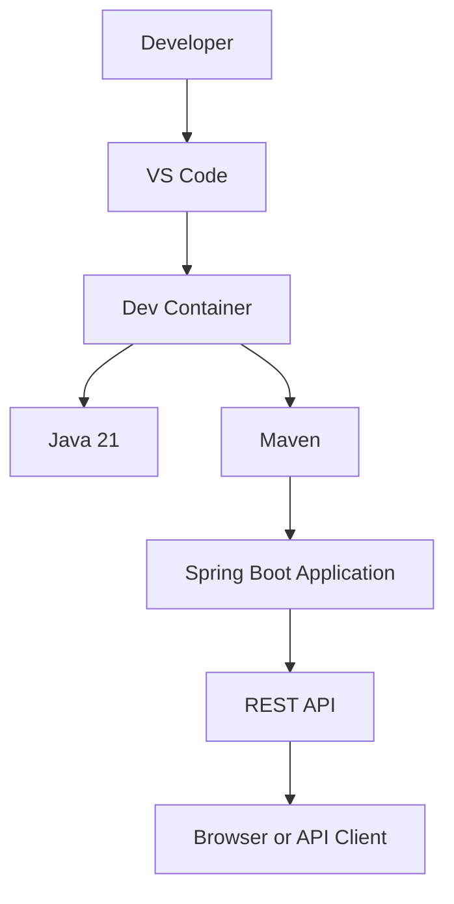

# Project Overview

Java Dev Container API is a Java 21 Spring Boot REST API designed to run inside a VS Code Dev Container.

The project demonstrates how a Java application can use a reproducible containerized development environment while exposing a simple REST API.

## Main components

The application consists of:

- A Java 21 Spring Boot application.
- A Maven-based build.
- A Dev Container providing the development environment.
- A structured documentation site powered by MkDocs.
- Markdown-based project documentation organized by reader intent.

## Documentation approach

Documentation is divided into four categories:

| Category    | Purpose                                                |
|-------------|--------------------------------------------------------|
| Tutorial    | Helps a new developer learn the project step by step   |
| How-to      | Helps developers accomplish specific tasks             |
| Reference   | Provides factual information for lookup                |
| Explanation | Describes architecture, concepts, and design decisions |

The separation prevents the README from becoming a large collection of unrelated documentation and makes it easier for readers to find the information they need.

## Architecture

The application runs inside the project's Dev Container and is exposed as a Spring Boot REST API.



### What this diagram represents

Conceptually:

```text
Developer
    ↓
VS Code
    ↓
Dev Container
    ↓
Java 21 + Maven
    ↓
Spring Boot
    ↓
REST API
    ↓
Browser / API Client
```